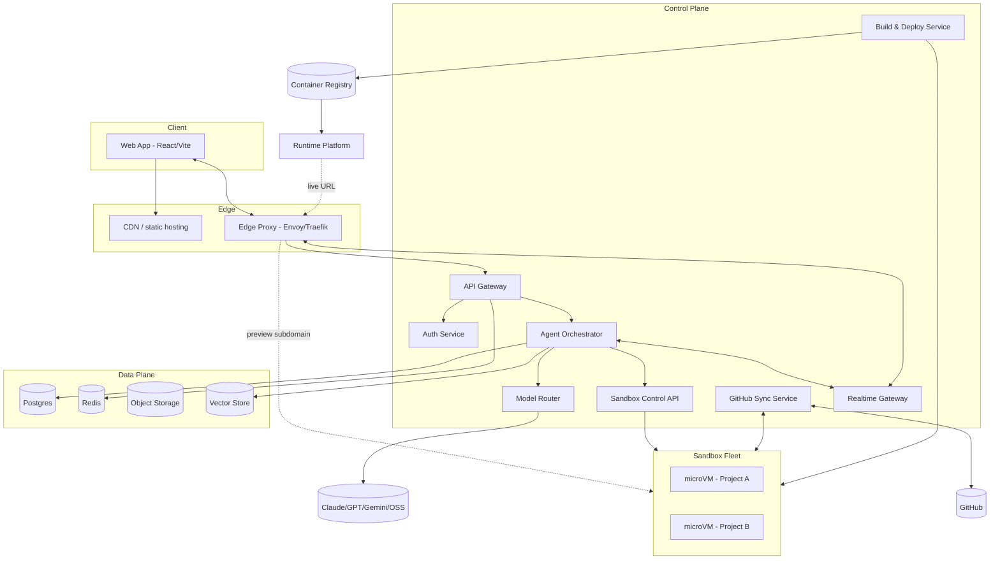

# Architect 2.0 — Technical Architecture

*How a prompt-to-app platform like architect.new works under the hood, and how I would build it for real.*

Architect (the product this repo prototypes the UI for) is a Lyzr-style "prompt-to-app" builder: a user describes an outcome, a team of agents plans and writes a working application in a live sandbox, the user watches a real-time preview while the agent works, and the finished app can be pushed to GitHub and deployed to a public URL. Architect 2.0 is my design for what actually runs behind that experience — not a demo, but a system that can hold thousands of paying users' projects open at once, safely, on any model provider.

See `architecture-diagram.svg` for the full system diagram. A simplified version is embedded below as Mermaid for quick reading on GitHub.

---

## 1. Sandboxes — what runs each user's app

**Choice: one Firecracker microVM per active project session, with gVisor/Kata as a fallback isolation layer on hosts where KVM nesting isn't available (e.g. some managed cloud VMs), orchestrated by a purpose-built sandbox control plane (conceptually similar to what E2B, Daytona, and Replit's own "Goval" runtime do).**

Why not plain Docker containers? Containers share the host kernel, and an agent in Architect is running *arbitrary, untrusted, often AI-generated code* — shell commands, package installs, dev servers listening on open ports. A container escape or a `rm -rf /` fat-fingered by the agent should never be able to touch another user's project or the control plane. Firecracker gives each session a real, hardware-isolated virtual machine with its own kernel, while staying light enough (measured in the E2B/Firecracker ecosystem at low tens of milliseconds boot time from a snapshot, and a few hundred MB of overhead) to run thousands per host fleet — something a full EC2/GCE VM per user could never do economically.

Design details:

- **Template images, not blank VMs.** Each supported stack (Node/Vite, Python/FastAPI, full-stack Postgres app, static site) has a pre-built rootfs template with dependencies pre-warmed and the dev server pre-configured. A new session boots from a *snapshot* of a running template VM (Firecracker supports snapshot/restore), not a cold boot — this is what gets time-to-first-preview down to sub-second instead of the 10–30s a `npm install` would take.
- **Copy-on-write filesystem per session.** The template rootfs is mounted read-only; each session gets a writable overlay. This makes spinning up a new project cheap in disk and lets us diff a session's overlay against the template to know exactly which files the agent touched — useful for the Code Review tab and for building the deploy artifact.
- **Idle-freeze, not idle-destroy.** When a user closes the tab, we don't tear the VM down immediately — we snapshot memory + disk state to object storage and free the compute slot. Reopening the project restores the snapshot (typically <250ms) instead of replaying the whole build. Only after a longer TTL (say 7 days of no activity) do we garbage-collect the snapshot itself.
- **Resource quotas per VM**: 1 vCPU / 512MB–2GB RAM by plan tier, a cgroup-enforced CPU/IO ceiling, no outbound network except an allow-list (package registries, the platform's own API, and — only when the user has explicitly connected them — GitHub and their chosen integrations). This is also where we stop an agent from being used as a botnet or crypto-miner.
- **A dedicated Sandbox Control API** (not the main API server) owns the VM lifecycle: `create`, `exec` (stream stdout/stderr back over gRPC), `fs.read/write/watch`, `snapshot`, `resume`, `destroy`. The Agent Orchestrator and the Build & Deploy Service are the only two internal callers of this API — the browser never talks to a sandbox directly for control operations, only for the proxied preview traffic (§4/§5).

---

## 2. The agent harness — planning, tool use, and recovery

The mockup's "Agent workspace" and "Dual-Mind Canvas" model the *user-facing* view of this; underneath, I'd build a fairly conventional but carefully-guarded **observe → plan → act loop**, run per-project inside the Agent Orchestrator service, not inside the sandbox (the sandbox only executes tools; the reasoning happens in the control plane so it can be paused, resumed, rate-limited, and audited independent of any one VM).

**Loop shape**
1. **Observe** — assemble context: the user's message, the current file tree (from the sandbox), a RAG lookup over the project's embeddings (§ vector store) for relevant existing code, the last N tool results, and the run's "contract" (goal, constraints, allowed tools) captured at agent-creation time, matching the Configure/Review flow in the mockup.
2. **Plan** — one model call, forced into a structured "next step" shape (a short natural-language plan line, shown in the UI as things like *"Mapping the right agent topology"*, plus the next concrete tool call). I'd keep planning and execution as separate calls rather than one giant ReAct blob — it's slower per step but far easier to checkpoint, show progress for, and recover from a bad plan without redoing completed work.
3. **Act** — execute exactly one tool call against the sandbox (write file / run command / git operation / search) or against an external tool (web research, read integration data). Every tool call is logged as an event with inputs, outputs, duration, and cost.
4. **Verify** — cheap, deterministic checks run after each meaningful change: typecheck, run the existing test suite, hit the dev server's health endpoint. This is what lets the agent "recover from errors" instead of confidently building on a broken state — a failed check is fed back into the next Observe step as a tool result, same as any other observation.
5. Repeat until the plan says "done," a step budget/cost budget is hit, or a step requires **human approval** (deploy, writing to `main`, an integration with side effects) — matching the "Ask for approval before deploy" and "Human approval" tool toggles already in the mockup's agent config.

**Multi-agent structure.** Rather than one monolithic agent, I'd keep the roster the mockup already implies — Architect (planner/PM), Research, UI Builder, Code, Deploy — as distinct *runtime contracts* (system prompt + tool allow-list + model choice), but run them through the *same* orchestrator loop and the *same* sandbox/session, coordinating through a shared task queue and a shared "project state" document rather than as separate processes. That gives the "Dual-Mind Canvas" hand-off visualization something real to show (which agent owns the current task) without the operational cost of running N independent long-lived agent services per project.

**Recovery and resumability.** Every step is persisted (Postgres: `agent_runs`, `agent_steps`) before it's executed, so a crashed orchestrator worker can pick a run back up at the last completed step — this is exactly the shape of a durable-execution workflow engine (Temporal is a good fit here), which also gives us built-in retry/backoff on transient tool or model failures for free, and turns "the tab was closed mid-run" into a non-event rather than a lost session, satisfying the mockup's "agent must exist in the team list the moment Create is clicked" requirement.

**Care and feeding**: cost/token budgets per run and per org (enforced by the Usage & Billing Meter before a step is allowed to call a model), step timeouts, a max-steps circuit breaker, and structured eval logging (prompt, response, verification result) so regressions in agent quality after a prompt or model change are caught by an offline eval suite before shipping, not by users.

---

## 3. Model-agnostic by design

Users (and the platform itself) need to swap between Claude, GPT, Gemini, and self-hosted open-source models — per agent role, per project, even mid-run — without every other service caring which one is active. This is the job of a **Model Router**, an internal service in front of every provider, conceptually the same pattern as LiteLLM's proxy or OpenRouter.

- **A single internal schema.** All internal callers (the Agent Orchestrator, above all) speak one normalized "messages + tools + structured output" contract. The Model Router owns translating that into each provider's native shape (Anthropic Messages API, OpenAI Chat Completions/Responses API, Gemini's API, or an OpenAI-compatible endpoint in front of a self-hosted vLLM cluster for open-weight models) and translating the response — including tool-call blocks, streaming deltas, and stop reasons — back to the same normalized shape. Nothing outside the router ever imports a vendor SDK.
- **Capability negotiation.** Each provider/model is registered with a small capability record — context window, whether it supports native tool calling or needs a prompt-based fallback, vision support, max output tokens, price per token. The orchestrator asks the router for "a model good at code, supports tools, under $X/1M tokens" rather than hardcoding a model name; this is also what powers the mockup's per-agent Model dropdown ("Lyzr Auto", "GPT-4o mini", "Claude 3.5 Sonnet", or a raw `custom-endpoint` URL in Developer mode) without every one of those options needing bespoke integration code elsewhere.
- **Routing policy, not routing code.** Which model serves a given agent role is config (a project- or org-level table), not a code branch — so "switch this project from Claude to GPT-4o" is a database write, and platform-wide default changes (e.g. a new model becomes the default planner) ship without a deploy.
- **Resilience**: automatic fallback to a secondary model on a provider outage or rate-limit (429/5xx), with the failure and fallback visible in the run's activity log rather than silently swapped, and per-provider circuit breakers so one provider's incident doesn't cascade into slow responses platform-wide.
- **Self-hosted/open models** run behind a small internal vLLM (or TGI) cluster exposed through an OpenAI-compatible endpoint, so from the router's perspective they're just another provider entry — this is what makes "open-source" a checkbox rather than a separate integration.

---

## 4. Frontend ↔ sandbox ↔ backend, and the live preview

Three distinct channels, deliberately kept separate:

1. **Control/API traffic** — the React app talks REST/JSON to the API Gateway for everything that isn't real-time (auth, project CRUD, settings, deployment history). Standard request/response, cached where sensible (React Query, matching the `@tanstack/react-query` already in this repo's dependency catalog).
2. **Realtime agent stream** — a WebSocket (SSE as a fallback for restrictive networks) from the browser to a **Realtime Gateway** service, which the Agent Orchestrator publishes events to (plan steps, tool calls, file diffs, chat tokens) over Redis pub/sub. This is what drives the "Agent run 00:04" progress list and the Copilot chat in the mockup, and it's why the gateway is a separate stateful-ish service from the stateless API Gateway — it needs to hold open connections and fan events out to whichever pod a given browser is attached to.
3. **Live preview** — the *actual app the agent is building*, served straight from the dev server (Vite/uvicorn/etc.) running inside the sandbox VM, on an internal port. The browser never talks to that dev server directly; it goes through the proxy layer at a per-session preview subdomain (`https://<session-id>.preview.architect.run`), which terminates TLS and forwards to the right VM's internal IP\:port — including the dev server's own HMR WebSocket, so file edits the agent makes show up in the preview live, the same as if the user were running `vite dev` locally. This is also how "Live Preview" in the mockup can sit next to "Code Review" and "Dual-Mind Canvas" as *tabs of the same session* rather than separate deployments.
4. **File sync** is not a separate sync protocol — the sandbox filesystem *is* the source of truth. The orchestrator's tool calls write directly to it over the Sandbox Control API, and the frontend's Code Review tab reads file contents/diffs through the same API (proxied through the API Gateway, not the raw sandbox network). There's no client-side CRDT or merge logic to build because the agent is the only writer during a run; the user's own edits (in Developer mode's Code Studio) go through the same `fs.write` path, so there's a single write path to reason about, not two systems to reconcile.

---

## 5. Where the proxy sits, and what it does

The **Edge Proxy** (Envoy or Traefik, self-hosted or as a managed edge like Cloudflare in front of it) is the single ingress point for everything public: `app.architect.dev` (the product UI), `api.architect.dev` (JSON/WS API), `*.preview.architect.run` (in-progress project previews), and `*.architect.run` / custom domains (deployed, published apps). It's deliberately *not* the same process as the API Gateway, because its job is different and needs to scale/fail differently:

- **TLS termination and cert management** (wildcard cert for `*.architect.run`, per-domain certs via ACME for custom domains).
- **Routing by hostname/subdomain**, not by path — the subdomain encodes either a session ID (preview) or a deployment ID (published app), which the proxy resolves (via a fast Redis-backed lookup, not a database round trip on every request) to the current sandbox host\:port or the current running release's backend.
- **WebSocket upgrade passthrough** for both the agent realtime stream and the preview app's own HMR/websocket traffic — this has to be handled explicitly since plain HTTP load balancers often mishandle long-lived upgraded connections.
- **AuthN at the edge for private previews**: a signed, short-lived cookie/token issued by the Auth Service gates access to a project's preview URL so a guessed subdomain doesn't leak someone else's work-in-progress app; published production apps are public by default unless the owner sets them private.
- **Rate limiting and basic DDoS absorption** before traffic ever reaches application services, plus request-size and connection caps per sandbox to stop one misbehaving preview app from starving its host.
- **Sticky routing** for the realtime WebSocket (a given browser connection needs to keep hitting the same Realtime Gateway pod for the life of the connection), done via consistent hashing on session ID at the proxy layer rather than in application code.

---

## 6. GitHub integration

Modeled closely on the existing `GithubModal`/`ImportFlow` screens in this repo, backed by a real **GitHub App** (not a personal OAuth token) so permissions are scoped per-repository and revocable, and so the platform — not a single user's token — owns the installation:

- **Connect**: standard GitHub App install flow; the user picks which repositories Architect may access. We store the installation ID and mint short-lived installation access tokens per request rather than storing a long-lived credential.
- **Import**: clone the selected repo/branch into a fresh sandbox (§1), run a detection pass (framework, package manager, env vars referenced in code but not set) — this is the "Reading project / Detecting framework / Finding environment requirements" sequence already mocked up in `ImportScan`.
- **Isolated branch work**: the agent never writes to the user's default branch directly. On first write, the GitHub Sync Service (or the agent itself, via `git` inside the sandbox, which is simpler and keeps history real) creates an `architect/<project-slug>` branch; all commits land there.
- **Review, not silent merge**: changes surface as a PR (opened via the GitHub API once there's something worth reviewing, updated with new commits as the agent iterates) so the existing GitHub review/CI workflow a team already has keeps working — Architect adds to that workflow instead of replacing it.
- **Webhooks back in**: a webhook receiver updates PR/check status in near-real-time in the Deployments/Activity views, and — if a human pushes a commit to the branch from *outside* Architect — triggers a re-sync into the sandbox so the live preview doesn't silently drift from GitHub's view of the branch.
- **Scopes stay minimal**: contents + pull-requests + checks by default; anything broader (e.g. Actions, org-level access) is a separate, explicitly-granted permission, in keeping with the "permission-first by default" principle already stated on the Integrations page in this repo's mockup.

---

## 7. Deployment — of user apps, and of Architect 2.0 itself

**Deploying a user's app.** The Build & Deploy Service takes the current sandbox filesystem (or the GitHub branch, if the user deploys from a PR) and runs a buildpacks-style build (Cloud Native Buildpacks, or a thin Dockerfile-generation step for stacks that need one) into an immutable container image, pushes it to a private registry, and rolls it out on a **multi-tenant runtime platform** — Kubernetes with Knative (scale-to-zero, request-driven autoscaling) is the right shape here, or a managed equivalent like Fly Machines/Cloud Run if I wanted to avoid operating Kubernetes myself in an early version. Each deployment gets:
- A generated subdomain (`<project>.architect.run`) immediately, and an optional custom domain (CNAME + automatic cert) later.
- Three environments matching the mockup's Deployments page — **preview** (every branch/PR, ephemeral), **staging**, **production** — each just a separately-tracked release pointer in Postgres plus its own runtime revision, so "rollback" is "point production at the previous image," not a rebuild.
- Environment variables resolved from a per-project secrets store (encrypted at rest, injected at container start, never written into the image or into git).

**Deploying Architect 2.0 itself.** The platform is the pnpm monorepo this repo already scaffolds (`artifacts/api-server`, `lib/db`, etc.) — I'd deploy it as a set of independently-scalable services on Kubernetes (or the managed equivalent) across at least two regions for redundancy:
- Stateless services (API Gateway, Auth, Agent Orchestrator, Model Router, Build & Deploy) as regular horizontally-scaled Deployments behind the Edge Proxy.
- The Realtime Gateway as its own Deployment, scaled on connection count rather than CPU, with Redis pub/sub as the fan-out backbone across pods.
- The Sandbox fleet as its own pool of bare-metal or nested-virtualization-capable hosts (Firecracker needs KVM access), managed by the Sandbox Orchestrator — kept separate from the Kubernetes cluster running the control plane, since its scaling and security profile (untrusted code execution) is fundamentally different from the rest of the platform.
- Postgres as a managed primary + read replicas (RDS/Cloud SQL-equivalent) with PgBouncer in front for connection pooling, since a fleet of short-lived orchestrator workers opening raw connections would exhaust Postgres's connection limit fast.
- Infrastructure as code (Terraform) and CI/CD (GitHub Actions building/pushing images, then a progressive rollout — canary or blue/green — for the control-plane services), so the platform deploys itself through basically the same pipeline it gives users, which is a nice property to have eaten your own dog food on.

---

## 8. Scaling to thousands of concurrent builders

The two resources that actually get scarce at scale are **sandbox compute** and **model-provider throughput** — everything else (API servers, Postgres reads, the proxy) scales in the conventional stateless-horizontal way, so I'll focus on those two plus the supporting pieces:

- **Sandbox fleet autoscaling and bin-packing.** The Sandbox Orchestrator tracks free capacity per host and packs new sessions onto the fullest host that still fits (better density, fewer half-empty machines), while keeping a small **pre-warmed pool** of already-booted template VMs per popular stack so "start a new project" doesn't wait on a cold boot. New hosts are added/removed from the pool based on queue depth and utilization, same shape as any cluster autoscaler.
- **Idle reclamation is the single biggest lever.** Because sessions freeze to a snapshot after inactivity (§1) instead of holding compute forever, the number of *live* VMs at any instant is much smaller than the number of *open projects* — this is what actually makes "thousands of users" affordable rather than requiring thousands of permanently-running VMs.
- **Admission control and queueing.** If demand spikes past available sandbox capacity, new session requests queue with a visible "starting your workspace…" state rather than degrading everyone's performance — same pattern already implied by the mockup's progress states — and plan tiers get priority weighting in that queue.
- **Model throughput**: the Model Router pools connections per provider, respects each provider's rate limits with a token-bucket per API key (and rotates across multiple provider API keys/organizations where the provider allows it), queues and backpressures agent steps rather than hammering a 429 loop, and spreads load across providers/models where the routing policy allows substitution — this is also a cost lever, not just a scaling one.
- **Stateless control-plane services** (API Gateway, Auth, Model Router, Build & Deploy) scale horizontally behind the proxy with no local state; the only sticky state is the Realtime Gateway's open connections, handled via consistent-hash routing at the edge (§5) plus Redis as the shared source of truth so any gateway pod can serve any session's events.
- **Data layer**: Postgres read replicas for the read-heavy dashboard/activity queries, the hot path (writing agent steps) kept narrow and indexed, Redis for anything session-shaped (presence, pub/sub, short-lived caches) so Postgres isn't asked to do both OLTP and realtime fan-out.
- **Multi-region** for the control plane and edge (lower latency, regional failover); the sandbox fleet is placed regionally near where a given org's users actually are, since sandbox exec latency is far more user-visible than an extra 50ms on a dashboard API call.
- **Observability as a first-class scaling tool**: per-service OpenTelemetry traces/metrics feeding Grafana + Loki/Tempo, with SLOs on the two things users actually feel — "time to first preview" and "agent step latency" — because those are the numbers that tell us we need more sandbox capacity or more model headroom *before* users notice, not after.

---

## Service inventory

| Service | Tech | Responsibility |
|---|---|---|
| Web App | React + Vite (already scaffolded here) | Creator/Developer UI, served via CDN |
| API Gateway | Express 5 (`artifacts/api-server`) | Stateless REST/OpenAPI entry point, authn, validation |
| Auth Service | OAuth (Google/GitHub) + sessions | Identity, orgs, RBAC |
| Agent Orchestrator | Node/TS service + durable workflow engine (Temporal) | Plan→act→observe loop, run state, checkpointing |
| Model Router | LiteLLM-style internal proxy | Normalizes Claude/GPT/Gemini/OSS behind one schema, routing, fallback |
| Sandbox Control API | gRPC service over Firecracker's API | VM lifecycle: create/exec/fs/snapshot/destroy |
| Sandbox Orchestrator | Custom bin-packing scheduler | Places sessions on hosts, prewarm pool, idle-freeze |
| Realtime Gateway | WS/SSE service + Redis pub/sub | Streams agent + preview events to the browser |
| GitHub Sync Service | GitHub App + webhooks | Import, branch isolation, PRs, status sync |
| Build & Deploy Service | Buildpacks/Docker + registry client | Builds images, promotes releases |
| Runtime Platform | Kubernetes + Knative (or Fly Machines) | Hosts deployed user apps, autoscaled, multi-env |
| Edge Proxy | Envoy/Traefik | TLS, subdomain routing, WS upgrade, rate limiting |
| Postgres | Managed, primary + replicas, Drizzle ORM (`lib/db`) | System of record: projects, runs, deployments |
| Redis | Managed | Sessions, pub/sub, queue backing store, routing cache |
| Object Storage | S3-compatible | Sandbox snapshots, build artifacts, template cache |
| Vector Store | pgvector or dedicated | Code/repo embeddings for agent RAG and run memory |
| Telemetry | OpenTelemetry → Grafana/Loki/Tempo | Metrics, logs, traces across every service above |

## Key trade-offs I made explicitly

- **Firecracker over plain containers** — more operational complexity (need KVM-capable hosts, a real orchestrator), but it's the only realistic answer to "run arbitrary AI-written code for thousands of strangers safely."
- **Separate reasoning (orchestrator) from execution (sandbox)** — costs an extra network hop per tool call versus running the agent loop inside the VM, but means a sandbox is a dumb, replaceable execution surface and all the interesting state/recovery/audit logic lives in one place I can actually operate and evolve.
- **A model router instead of calling providers directly** — an extra service and a small latency tax, in exchange for genuinely swapping models without touching the orchestrator, and a single place to enforce budgets, fallbacks, and eval logging.
- **PR-based GitHub writes instead of direct pushes to main** — slower for the user to see code "land," but it's the only version of this that a team with existing review/CI norms will actually trust.
- **Buildpacks over letting agents write arbitrary Dockerfiles** — less flexible for exotic stacks, but removes an entire class of build-time security and reproducibility problems for the common case.
